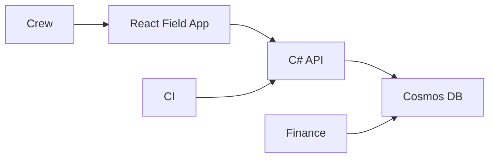

# Case Study: Field Operations App — Workflow Modernization

## 1. Executive Summary

A field-services organization transitioned from PDF + SharePoint workflows to a structured cloud-native application to improve invoicing accuracy, reporting consistency, and audit readiness.

---

## 2. Business Context & Constraints

### Problem
Manual document workflows caused billing errors, slow invoice turnaround, and poor data searchability.

### Objectives
- Faster invoicing
- Standardized reporting
- Improved audit traceability

### Constraints
- Field usability requirements
- Prior failed app attempts
- Need for incremental rollout

---

## 3. High-Level Architecture

- React frontend
- C# API (Azure App Service)
- Azure Cosmos DB
- Azure DevOps CI/CD

---

## Architecture Diagrams

---

## 4. Data Modeling Strategy

- Structured form records
- Centralized rate/code validation
- Flexible schema evolution via document model

---

## 5. Key Architectural Decisions

- Replace PDFs with structured data capture
- Centralize validation logic
- CI/CD-driven iterative delivery

---

## 6. Failure Modes & Mitigations

- Field resistance → iterative UX refinement
- Schema drift → versioned models
- Deployment instability → automated pipelines

---

## 7. Security & Operational Considerations

- Role-based access (crew vs admin)
- Controlled rate assignment
- Audit-friendly structured data

---

## 8. Scaling & Future Evolution

- Support for additional business units
- Reporting enhancements
- Potential mobile-first refinement

---

## 9. Outcomes

- 750 users (~50% workforce)
- Faster invoicing
- Reduced billing corrections
- Improved searchability

---

## Summary

This project demonstrates pragmatic modernization of document workflows into a scalable, validated, cloud-native system with measurable operational improvements.

