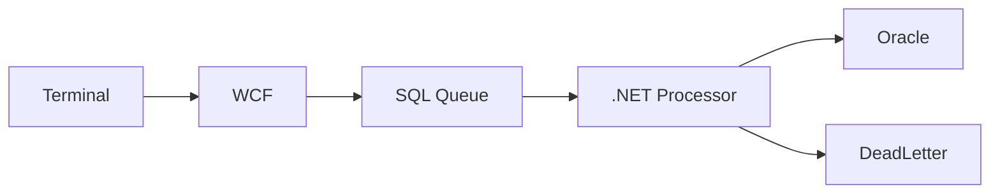

# Case Study: Distributed Data Synchronization Platform

## 1. Executive Summary

A centralized .NET synchronization service processed queued messages from distributed retail terminals, transforming and loading data into Oracle while pushing inventory updates back to terminals. The system was modernized to improve reliability, throughput, and observability.

---

## 2. Business Context & Constraints

### Problem
Frequent data mismatches, silent message loss, and manual resynchronizations undermined reliability.

### Objectives
- Eliminate data loss
- Increase throughput
- Improve traceability

### Constraints
- Pre-cloud infrastructure
- WCF (SOAP) communication
- SQL-based queue

---

## 3. High-Level Architecture

- Retail terminals (SQL Server local)
- WCF service endpoints
- SQL queue table
- .NET C# central processing app
- Oracle central database

---

## Architecture Diagram

---

## 4. Data & Queue Strategy

- Explicit message states
- Retry counters
- Dead-letter table
- Idempotent processing via message IDs

---

## 5. Key Architectural Improvements

- ThreadPool-based controlled parallelism
- Structured retry handling
- Index tuning (Oracle & SQL Server)
- Enhanced logging and auditing

---

## 6. Failure Modes & Mitigations

- Silent failures → explicit state transitions
- Duplicate processing → idempotency checks
- Backlogs → bounded concurrency

---

## 7. Security & Integrity Considerations

- Message lifecycle auditing
- Controlled retry policies
- Reduced data inconsistency risk

---

## 8. Scaling & Future Evolution

- Increased worker parallelism
- Batch optimization
- Potential message broker replacement if needed

---

## 9. Outcomes

- Reliable synchronization
- Reduced manual resync
- Improved throughput
- Increased operational confidence

---

## Summary

This project demonstrates distributed systems reliability engineering using WCF, SQL-based queues, and disciplined concurrency control in a pre-cloud enterprise environment.

