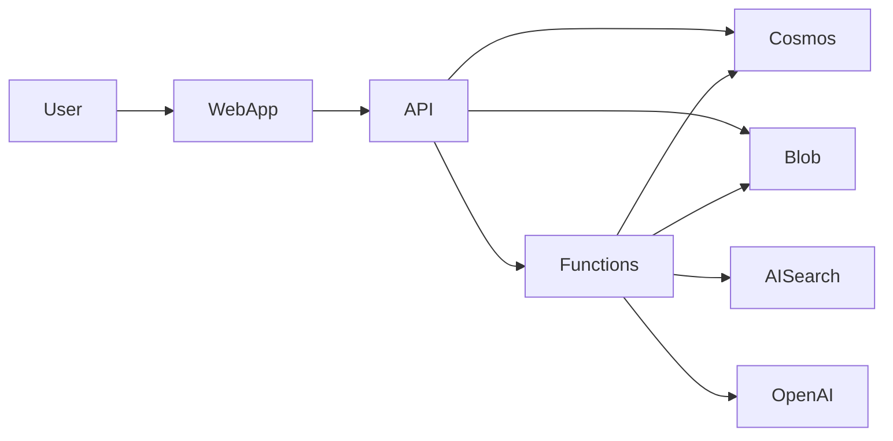
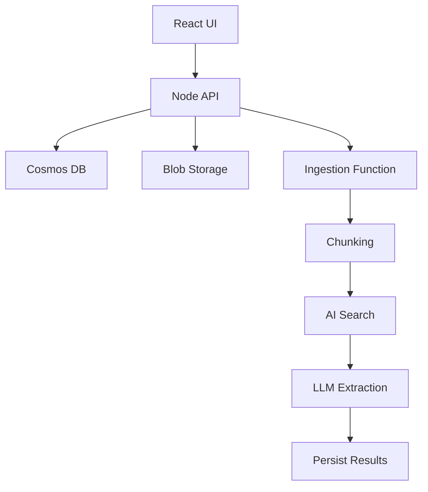

# Case Study: MeetingAware — Secure Multi-Tenant AI SaaS Platform

## 1. Executive Summary

MeetingAware is a multi-tenant SaaS platform that transforms unstructured meeting transcripts into structured, compliance-ready insights using Retrieval-Augmented Generation (RAG) and large language models. The architecture prioritizes tenant isolation, secure-by-design cloud patterns, and pragmatic delivery velocity.

---

## 2. Business Context & Constraints

### Problem
Organizations generate high volumes of meeting data containing decisions, risks, and requirements that are rarely structured or searchable.

### Objectives
- Extract structured signals from transcripts
- Support compliance and audit workflows
- Enable AI-driven insights
- Operate as a scalable SaaS platform

### Constraints
- Sensitive PII in transcripts
- Small engineering team
- Rapidly evolving product requirements

---

## 3. High-Level Architecture

### Core Stack
- React frontend
- Node.js API (Azure App Service)
- Azure Functions (async processing)
- Azure Cosmos DB (document model)
- Azure Blob Storage
- Azure AI Search (vector + hybrid)
- Azure OpenAI
- Azure DevOps CI/CD

### Architectural Pattern
Modular monolith with asynchronous processing extensions.

---

## Architecture Diagrams

### Context Diagram

### Container Diagram

---

## 4. Data Modeling Strategy

- TenantId as partition key
- Document-based flexible schema
- Versioned knowledge base for RAG
- Structured outputs stored separately from raw transcript

---

## 5. Key Architectural Decisions

- Managed services over Kubernetes
- Document DB over relational
- Hybrid tenant isolation model
- Modular monolith first

---

## 6. Failure Modes & Mitigations

- Token limits → chunking + map-reduce
- Retrieval misses → hybrid search + regression validation
- Cross-tenant leakage risk → enforced TenantId scoping
- Hot partitions → monitoring + isolation strategy

---

## 7. Security & Operational Considerations

- Managed identity between services
- Tenant-boundary enforcement at API layer
- Optional PII redaction pipeline
- Controlled transcript lifecycle
- Regression pipeline for AI outputs

---

## 8. Scaling & Future Evolution

- Independent scaling of API and Functions
- Dedicated environments for large tenants
- Potential service extraction if bounded contexts grow

---

## 9. Lessons Learned

- AI systems require evaluation harnesses
- Tenant partitioning discipline is critical
- Managed services accelerate early delivery
- Explicit trade-offs reduce architectural drift

---

## Summary

MeetingAware demonstrates pragmatic AI-enabled SaaS architecture balancing velocity, scalability, and governance in a consultancy-style delivery context.

