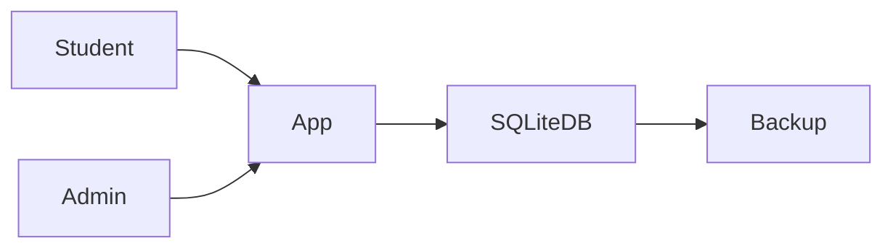

# Case Study: YogaFlow — Offline-First Studio Management App

## 1. Executive Summary

YogaFlow is an Android mobile application built with Cordova and SQLite to manage student attendance and credit tracking in an offline-first studio environment.

---

## 2. Business Context & Constraints

### Problem
Attendance and credits were previously tracked using paper cards and pen, leading to errors and lack of reporting visibility.

### Objectives
- Digitize attendance tracking
- Safely manage credit balances
- Enable student self-registration
- Keep system simple and cost-efficient

### Constraints
- No cloud infrastructure
- Limited IT support
- Single-location deployment

---

## 3. High-Level Architecture

- Cordova-based Android app
- SQLite local database
- Periodic manual backup process

---

## Architecture Diagram

---

## 4. Data Modeling Strategy

- Users table
- Sessions table
- Attendance table
- Credit transaction tracking
- Transaction-safe updates

---

## 5. Key Architectural Decisions

- Offline-first design
- Local SQLite over cloud DB
- Simplified operational footprint

---

## 6. Failure Modes & Mitigations

- Device failure → periodic backup
- Credit miscalculation → transactional updates
- Data corruption → structured schema + validation

---

## 7. Security & Operational Considerations

- Local data protection
- Role separation (admin vs student)
- Controlled deletion/deactivation of users

---

## 8. Scaling & Future Evolution

- Potential migration to cloud-backed API
- Multi-device synchronization if business grows

---

## 9. Outcomes

- Eliminated manual tracking errors
- Improved credit accuracy
- Increased operational efficiency

---

## Summary

YogaFlow illustrates pragmatic, constraint-driven architecture where simplicity, reliability, and cost control outweigh unnecessary cloud complexity.

