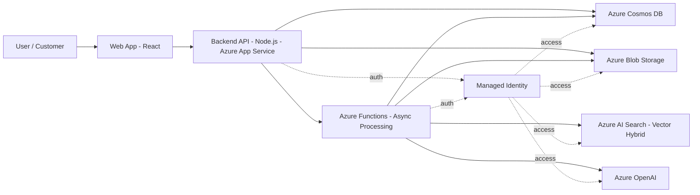
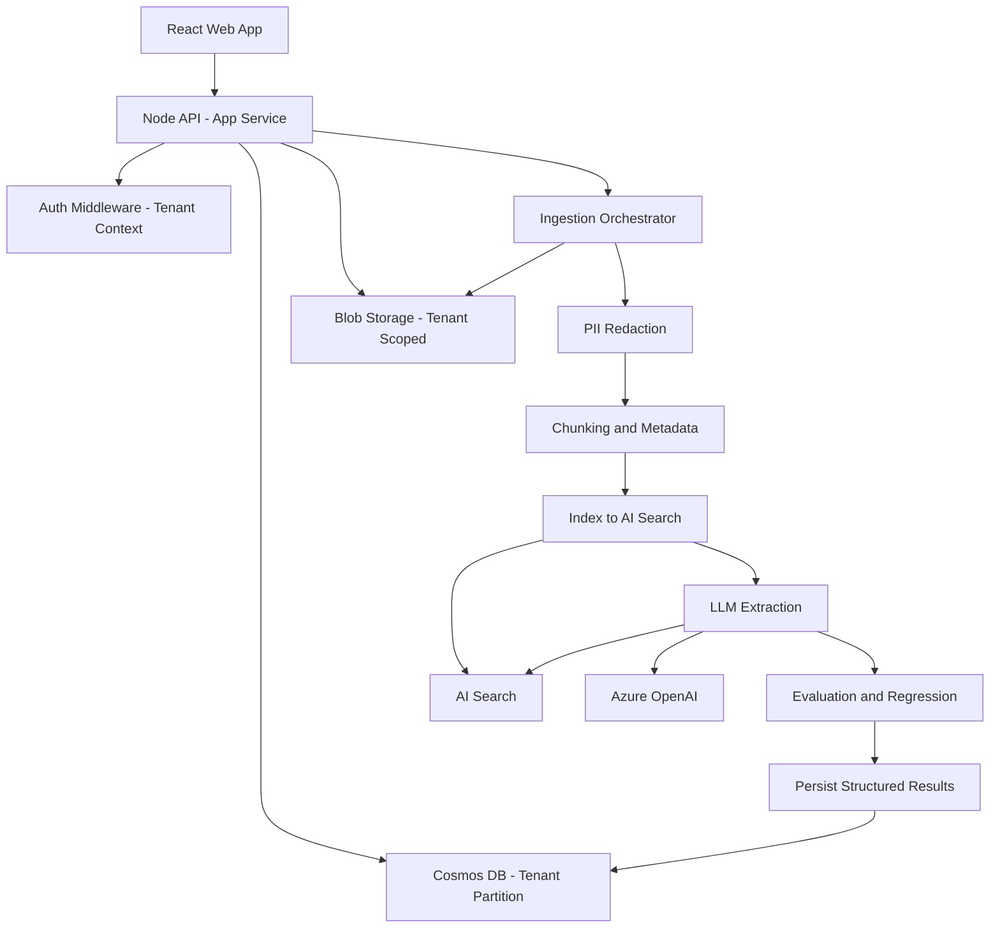

# MeetingAware Architecture Diagrams (Mermaid)

Copy this file into:

- `diagrams/meetingaware-architecture-diagrams.md`

These diagrams are written in **Mermaid** and simplified to avoid common GitHub rendering issues (no multiline labels, minimal special characters).

---

## 1) Context Diagram (System Landscape)

---

## 2) Container Diagram (Internal Components)

---

## Notes

- TenantId is enforced in the API layer and used as the Cosmos partition key.
- API and Functions scale independently.
- Validation stage protects against RAG regressions and schema drift.

These diagrams intentionally favor clarity over visual complexity for consultancy discussions.

